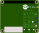

# KCH - Raspberry Pi Hat

A Raspberry Pi 4 add-on board to protect and power the Pi from the v4 SR kit, and provide a visual indicator of the state of the brain board's software as detailed in the [specification](./spec.md).

## The UI
The UI is illustrated below.

## Manufacturing
The board was designed to be manufactured using [JLCPCB](https://jlcpcb.com/) for both the PCB and assembly. This is using as 2 layer board with single sided assembly. The two through-hole connectors are rear-mounted and manually added after.

The BOM and assembly files can be generated with [KiCAD JLCPCB tools](https://github.com/Bouni/kicad-jlcpcb-tools) and the JLCPCB part codes are already assigned.